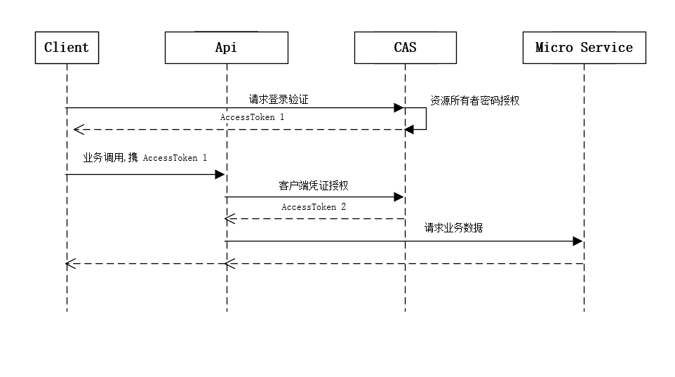
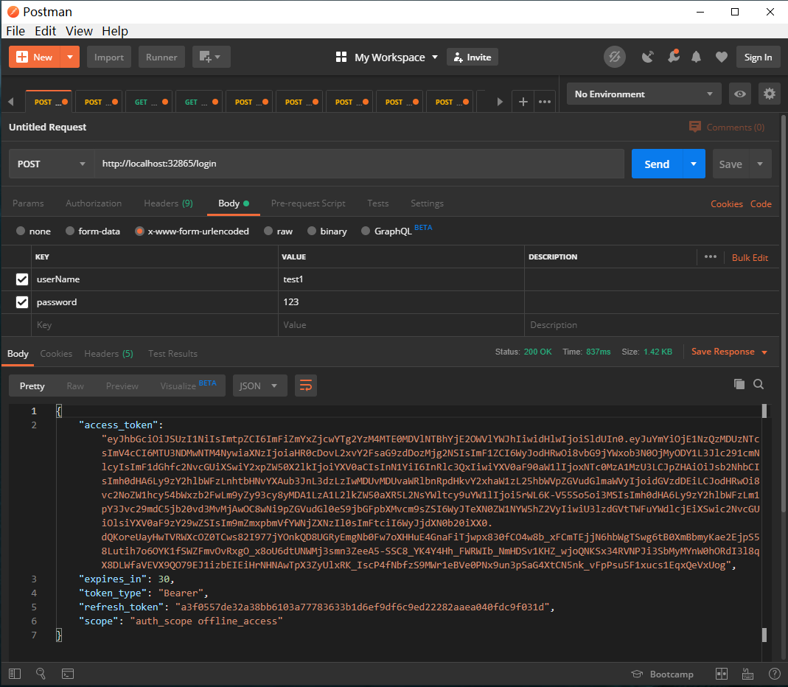
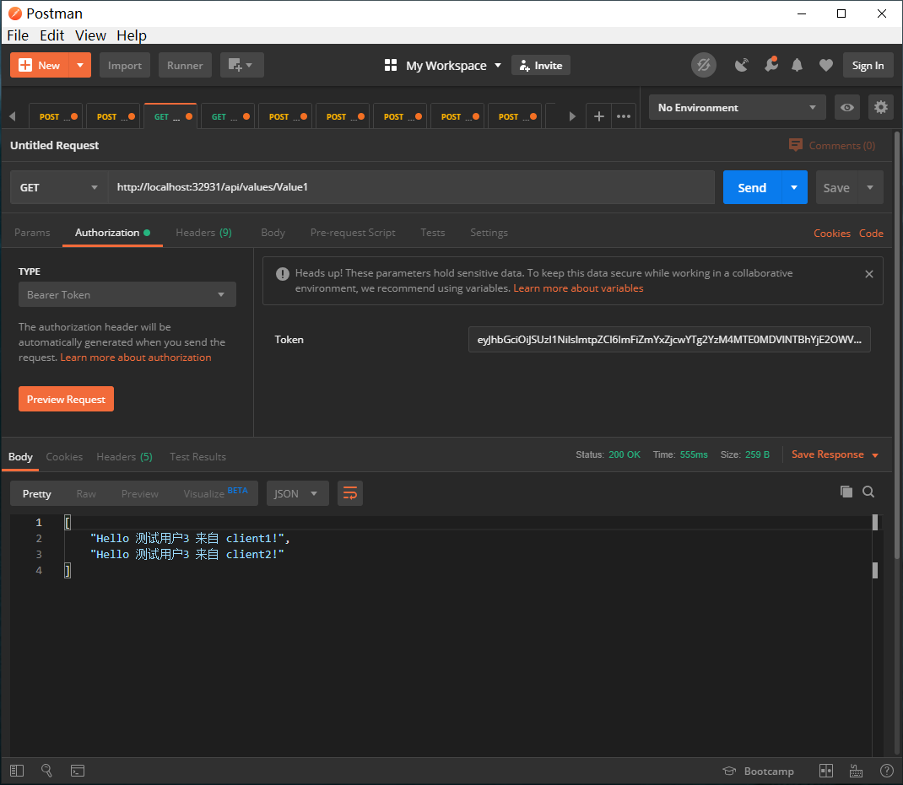
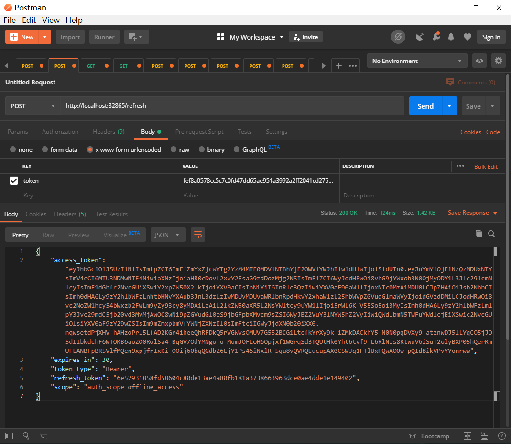

# CAS demo

这是一个基于 IdentityServer4 组建 CAS 的 demo 示例。模拟了基于用户名密码的登录验证，以及 API 的安全验证，Action不同角色的操作权限等等。

请求的时序图：

<b>第一步</b>

postman 请求 http://localhost:32865/login，输入用户名及密码，调用得到一个 jwt 数据，其中包含 access_token、refresh_token 及过期时间 expires_in。

<b>第二步</b>

postman 请求 http://localhost:32931/api/values/Value1，使用 Bearer Token，将第一步得到的 access_token 携带上，请求 api 接口。示例里一共预设了4个用户，分别是test1、test2、test2和test4，test1可以访问 api 的 Value1、Value2 和 Value3，test2不能访问任何接口，test3只能访问 Value1 接口。

<b>第三步</b>

当 token 过期时，取第一步返回的 refresh_token ，用 postman 请求 http://localhost:32865/refresh 以得到一个新的 access_token，再去重复第二步。

